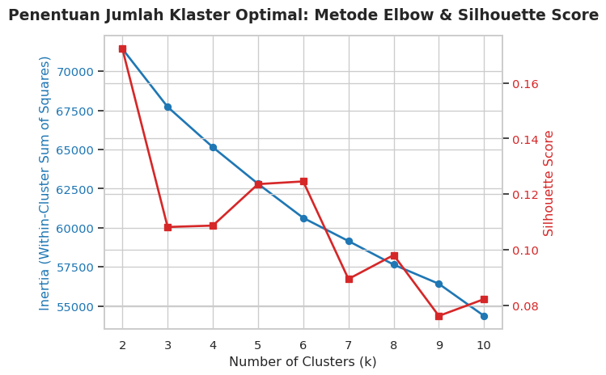
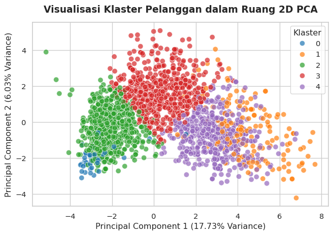

# Customer Personality Analysis - Unsupervised Learning Tugas 3
Muhammad Hidayat

``` yaml
Nama: Muhammad Hidayat
NIM: 052747132
```

``` python
import pandas as pd
import numpy as np
from sklearn.preprocessing import StandardScaler, OneHotEncoder
from sklearn.impute import SimpleImputer
from sklearn.cluster import KMeans
from sklearn.metrics import silhouette_score
from sklearn.decomposition import PCA
import matplotlib.pyplot as plt
import seaborn as sns
from IPython.display import display

sns.set_theme(style="whitegrid")
```

# Step 1: Memuat Dataset

File `cpa.csv` sebenarnya merupakan tab-delimited, jadi kita perlu
menyebutkan `sep='\t'` saat membacanya dengan `pd.read_csv()`.

``` python
data = pd.read_csv('cpa.csv', sep='\t')
display(data.head())
```

<div>
<style scoped>
    .dataframe tbody tr th:only-of-type {
        vertical-align: middle;
    }
&#10;    .dataframe tbody tr th {
        vertical-align: top;
    }
&#10;    .dataframe thead th {
        text-align: right;
    }
</style>

|  | ID | Year_Birth | Education | Marital_Status | Income | Kidhome | Teenhome | Dt_Customer | Recency | MntWines | ... | NumWebVisitsMonth | AcceptedCmp3 | AcceptedCmp4 | AcceptedCmp5 | AcceptedCmp1 | AcceptedCmp2 | Complain | Z_CostContact | Z_Revenue | Response |
|----|----|----|----|----|----|----|----|----|----|----|----|----|----|----|----|----|----|----|----|----|----|
| 0 | 5524 | 1957 | Graduation | Single | 58138.0 | 0 | 0 | 04-09-2012 | 58 | 635 | ... | 7 | 0 | 0 | 0 | 0 | 0 | 0 | 3 | 11 | 1 |
| 1 | 2174 | 1954 | Graduation | Single | 46344.0 | 1 | 1 | 08-03-2014 | 38 | 11 | ... | 5 | 0 | 0 | 0 | 0 | 0 | 0 | 3 | 11 | 0 |
| 2 | 4141 | 1965 | Graduation | Together | 71613.0 | 0 | 0 | 21-08-2013 | 26 | 426 | ... | 4 | 0 | 0 | 0 | 0 | 0 | 0 | 3 | 11 | 0 |
| 3 | 6182 | 1984 | Graduation | Together | 26646.0 | 1 | 0 | 10-02-2014 | 26 | 11 | ... | 6 | 0 | 0 | 0 | 0 | 0 | 0 | 3 | 11 | 0 |
| 4 | 5324 | 1981 | PhD | Married | 58293.0 | 1 | 0 | 19-01-2014 | 94 | 173 | ... | 5 | 0 | 0 | 0 | 0 | 0 | 0 | 3 | 11 | 0 |

<p>5 rows × 29 columns</p>
</div>

# Step 2: Eksplorasi Data & Pembersihan Awal

Beberapa langkah eksplorasi dan pembersihan awal yang bisa dilakukan:

- Cek tipe data dan jumlah missing value per kolom
- Cek statistik untuk kolom numerik
- Cek jumlah kategori unik untuk kolom kategori

Pertama, kita akan melihat tipe data dan jumlah missing value:

``` python
display(data.dtypes)
```

    ID                       int64
    Year_Birth               int64
    Education                  str
    Marital_Status             str
    Income                 float64
    Kidhome                  int64
    Teenhome                 int64
    Dt_Customer                str
    Recency                  int64
    MntWines                 int64
    MntFruits                int64
    MntMeatProducts          int64
    MntFishProducts          int64
    MntSweetProducts         int64
    MntGoldProds             int64
    NumDealsPurchases        int64
    NumWebPurchases          int64
    NumCatalogPurchases      int64
    NumStorePurchases        int64
    NumWebVisitsMonth        int64
    AcceptedCmp3             int64
    AcceptedCmp4             int64
    AcceptedCmp5             int64
    AcceptedCmp1             int64
    AcceptedCmp2             int64
    Complain                 int64
    Z_CostContact            int64
    Z_Revenue                int64
    Response                 int64
    dtype: object

``` python
missing_info = data.isnull().sum()
print("Kolom dengan nilai kosong:")
print(missing_info[missing_info > 0])
```

    Kolom dengan nilai kosong:
    Income    24
    dtype: int64

Terdapat 24 baris kosong di kolom `Income`. Kita akan melakukan imputasi
untuk kolom ini nanti.

Selanjutnya, kita bisa melihat statistik untuk kolom numerik, dipecah
per 9 kolom untuk memudahkan pembacaan:

``` python
numeric_cols = data.select_dtypes(include=[np.number]).columns
for i in range(0, len(numeric_cols), 9):
    display(data[numeric_cols[i:i+9]].describe())
```

<div>
<style scoped>
    .dataframe tbody tr th:only-of-type {
        vertical-align: middle;
    }
&#10;    .dataframe tbody tr th {
        vertical-align: top;
    }
&#10;    .dataframe thead th {
        text-align: right;
    }
</style>

|  | ID | Year_Birth | Income | Kidhome | Teenhome | Recency | MntWines | MntFruits | MntMeatProducts |
|----|----|----|----|----|----|----|----|----|----|
| count | 2240.000000 | 2240.000000 | 2216.000000 | 2240.000000 | 2240.000000 | 2240.000000 | 2240.000000 | 2240.000000 | 2240.000000 |
| mean | 5592.159821 | 1968.805804 | 52247.251354 | 0.444196 | 0.506250 | 49.109375 | 303.935714 | 26.302232 | 166.950000 |
| std | 3246.662198 | 11.984069 | 25173.076661 | 0.538398 | 0.544538 | 28.962453 | 336.597393 | 39.773434 | 225.715373 |
| min | 0.000000 | 1893.000000 | 1730.000000 | 0.000000 | 0.000000 | 0.000000 | 0.000000 | 0.000000 | 0.000000 |
| 25% | 2828.250000 | 1959.000000 | 35303.000000 | 0.000000 | 0.000000 | 24.000000 | 23.750000 | 1.000000 | 16.000000 |
| 50% | 5458.500000 | 1970.000000 | 51381.500000 | 0.000000 | 0.000000 | 49.000000 | 173.500000 | 8.000000 | 67.000000 |
| 75% | 8427.750000 | 1977.000000 | 68522.000000 | 1.000000 | 1.000000 | 74.000000 | 504.250000 | 33.000000 | 232.000000 |
| max | 11191.000000 | 1996.000000 | 666666.000000 | 2.000000 | 2.000000 | 99.000000 | 1493.000000 | 199.000000 | 1725.000000 |

</div>

<div>
<style scoped>
    .dataframe tbody tr th:only-of-type {
        vertical-align: middle;
    }
&#10;    .dataframe tbody tr th {
        vertical-align: top;
    }
&#10;    .dataframe thead th {
        text-align: right;
    }
</style>

|  | MntFishProducts | MntSweetProducts | MntGoldProds | NumDealsPurchases | NumWebPurchases | NumCatalogPurchases | NumStorePurchases | NumWebVisitsMonth | AcceptedCmp3 |
|----|----|----|----|----|----|----|----|----|----|
| count | 2240.000000 | 2240.000000 | 2240.000000 | 2240.000000 | 2240.000000 | 2240.000000 | 2240.000000 | 2240.000000 | 2240.000000 |
| mean | 37.525446 | 27.062946 | 44.021875 | 2.325000 | 4.084821 | 2.662054 | 5.790179 | 5.316518 | 0.072768 |
| std | 54.628979 | 41.280498 | 52.167439 | 1.932238 | 2.778714 | 2.923101 | 3.250958 | 2.426645 | 0.259813 |
| min | 0.000000 | 0.000000 | 0.000000 | 0.000000 | 0.000000 | 0.000000 | 0.000000 | 0.000000 | 0.000000 |
| 25% | 3.000000 | 1.000000 | 9.000000 | 1.000000 | 2.000000 | 0.000000 | 3.000000 | 3.000000 | 0.000000 |
| 50% | 12.000000 | 8.000000 | 24.000000 | 2.000000 | 4.000000 | 2.000000 | 5.000000 | 6.000000 | 0.000000 |
| 75% | 50.000000 | 33.000000 | 56.000000 | 3.000000 | 6.000000 | 4.000000 | 8.000000 | 7.000000 | 0.000000 |
| max | 259.000000 | 263.000000 | 362.000000 | 15.000000 | 27.000000 | 28.000000 | 13.000000 | 20.000000 | 1.000000 |

</div>

<div>
<style scoped>
    .dataframe tbody tr th:only-of-type {
        vertical-align: middle;
    }
&#10;    .dataframe tbody tr th {
        vertical-align: top;
    }
&#10;    .dataframe thead th {
        text-align: right;
    }
</style>

|  | AcceptedCmp4 | AcceptedCmp5 | AcceptedCmp1 | AcceptedCmp2 | Complain | Z_CostContact | Z_Revenue | Response |
|----|----|----|----|----|----|----|----|----|
| count | 2240.000000 | 2240.000000 | 2240.000000 | 2240.000000 | 2240.000000 | 2240.0 | 2240.0 | 2240.000000 |
| mean | 0.074554 | 0.072768 | 0.064286 | 0.013393 | 0.009375 | 3.0 | 11.0 | 0.149107 |
| std | 0.262728 | 0.259813 | 0.245316 | 0.114976 | 0.096391 | 0.0 | 0.0 | 0.356274 |
| min | 0.000000 | 0.000000 | 0.000000 | 0.000000 | 0.000000 | 3.0 | 11.0 | 0.000000 |
| 25% | 0.000000 | 0.000000 | 0.000000 | 0.000000 | 0.000000 | 3.0 | 11.0 | 0.000000 |
| 50% | 0.000000 | 0.000000 | 0.000000 | 0.000000 | 0.000000 | 3.0 | 11.0 | 0.000000 |
| 75% | 0.000000 | 0.000000 | 0.000000 | 0.000000 | 0.000000 | 3.0 | 11.0 | 0.000000 |
| max | 1.000000 | 1.000000 | 1.000000 | 1.000000 | 1.000000 | 3.0 | 11.0 | 1.000000 |

</div>

Kolom `Z_CostContact` dan `Z_Revenue` menunjukkan standar deviasi nol,
yang berarti semua nilai di kolom tersebut sama. Kita bisa menghapus
kedua kolom ini karena tidak memberikan informasi yang berguna untuk
klasterisasi. Kolom `ID` juga tidak relevan untuk analisis klasterisasi,
jadi kita akan menghapusnya juga.

Terakhir, kita bisa melihat jumlah kategori unik untuk kolom kategori:

``` python
categorical_cols = data.select_dtypes(include=['str']).columns
for col in categorical_cols:
    print(f"Kolom '{col}' memiliki {data[col].nunique()} kategori unik.")
```

    Kolom 'Education' memiliki 5 kategori unik.
    Kolom 'Marital_Status' memiliki 8 kategori unik.
    Kolom 'Dt_Customer' memiliki 663 kategori unik.

Kolom ‘Education’ memiliki 5 kategori unik dan kolom ‘Marital_Status’
memiliki 8. Kolom ‘Dt_Customer’, yang memiliki 663 kategori unik, akan
kita anggap sebagai kolom tersendiri dan akan diproses sebagai tanggal.

# Step 3: Identifikasi kolom numerik & kategori

Dari langkah eksplorasi sebelumnya, kita sudah mengidentifikasi kolom
numerik dan kategori. Untuk sebagian besar kolom, bisa saja digunakan
apa adanya. Untuk kolom `Dt_Customer`, kita bisa mengubahnya menjadi
fitur numerik dengan menghitung jumlah hari sejak tanggal tersebut
hingga tanggal terakhir dalam dataset. Sama halnya dengan kolom
`Year_Birth`, kita bisa mengubahnya menjadi umur dengan menghitung
selisih antara tahun saat ini dan tahun lahir. Data yang telah diubah
ini akan kita simpan dalam variabel baru agar tidak tercampur dengan
data asli.

Untuk mempermudah, kita akan menyimpan nama-nama kolom numerik dan
kategori dalam variabel terpisah:

``` python
# Kolom yang akan dihapus
cols_to_drop = ['ID', 'Z_CostContact', 'Z_Revenue']

data_processed = data.drop(columns=cols_to_drop)

# Proses fitur 'Dt_Customer' menjadi 'Customer_Since_Days' dan 'Year_Birth' menjadi 'Age'
data_processed['Dt_Customer'] = pd.to_datetime(data_processed['Dt_Customer'], format='%d-%m-%Y', errors='coerce')
_max_date = data_processed['Dt_Customer'].max()
data_processed['Customer_Since_Days'] = (_max_date - data_processed['Dt_Customer']).dt.days
data_processed['Age'] = 2024 - data_processed['Year_Birth']

# Hapus kolom asli setelah diubah, gunakan inplace=True agar langsung diterapkan
data_processed.drop(columns=['Dt_Customer', 'Year_Birth'], inplace=True)

# Kelomokan nama kolom numerik dan kategori
numerical_cols = data_processed.select_dtypes(include=[np.number]).columns.tolist()
categorical_cols = data_processed.select_dtypes(include=['str']).columns.tolist()

print(f"Kolom Numerik ({len(numerical_cols)}):\n")
for col in numerical_cols:
    print(f"- {col}")

print(f"\nKolom Kategori ({len(categorical_cols)}):\n")
for col in categorical_cols:
    print(f"- {col}")
```

Kolom Numerik (24):

- Income
- Kidhome
- Teenhome
- Recency
- MntWines
- MntFruits
- MntMeatProducts
- MntFishProducts
- MntSweetProducts
- MntGoldProds
- NumDealsPurchases
- NumWebPurchases
- NumCatalogPurchases
- NumStorePurchases
- NumWebVisitsMonth
- AcceptedCmp3
- AcceptedCmp4
- AcceptedCmp5
- AcceptedCmp1
- AcceptedCmp2
- Complain
- Response
- Customer_Since_Days
- Age

Kolom Kategori (2):

- Education
- Marital_Status

# Step 4: Imputasi missing value

Kita akan melakukan imputasi untuk kolom `Income` yang memiliki 24 nilai
kosong. Karena `Income` adalah kolom numerik, kita bisa menggunakan
strategi imputasi seperti median atau mean. Dalam kasus ini, kita akan
menggunakan median karena lebih tahan terhadap outlier.

``` python
imputer = SimpleImputer(strategy='median')
data_processed['Income'] = imputer.fit_transform(data_processed[['Income']])

print("Jumlah nilai kosong setelah imputasi:")
print(data_processed['Income'].isnull().sum())
```

    Jumlah nilai kosong setelah imputasi:
    0

Kita tampilkan statistik untuk kolom `Customer_Since_Days` dan `Age`
setelah proses transformasi, serta perbandingan antara kolom `Income`
sebelum dan sesudah imputasi.

``` python
display(data_processed[['Customer_Since_Days', 'Age']].describe())
```

<div>
<style scoped>
    .dataframe tbody tr th:only-of-type {
        vertical-align: middle;
    }
&#10;    .dataframe tbody tr th {
        vertical-align: top;
    }
&#10;    .dataframe thead th {
        text-align: right;
    }
</style>

|       | Customer_Since_Days | Age         |
|-------|---------------------|-------------|
| count | 2240.000000         | 2240.000000 |
| mean  | 353.582143          | 55.194196   |
| std   | 202.122512          | 11.984069   |
| min   | 0.000000            | 28.000000   |
| 25%   | 180.750000          | 47.000000   |
| 50%   | 355.500000          | 54.000000   |
| 75%   | 529.000000          | 65.000000   |
| max   | 699.000000          | 131.000000  |

</div>

``` python
income_comparison = pd.DataFrame({
    'Income (pre)': data['Income'],
    'Income (post)': data_processed['Income']
})
display(income_comparison.describe())
```

<div>
<style scoped>
    .dataframe tbody tr th:only-of-type {
        vertical-align: middle;
    }
&#10;    .dataframe tbody tr th {
        vertical-align: top;
    }
&#10;    .dataframe thead th {
        text-align: right;
    }
</style>

|       | Income (pre)  | Income (post) |
|-------|---------------|---------------|
| count | 2216.000000   | 2240.000000   |
| mean  | 52247.251354  | 52237.975446  |
| std   | 25173.076661  | 25037.955891  |
| min   | 1730.000000   | 1730.000000   |
| 25%   | 35303.000000  | 35538.750000  |
| 50%   | 51381.500000  | 51381.500000  |
| 75%   | 68522.000000  | 68289.750000  |
| max   | 666666.000000 | 666666.000000 |

</div>

# Step 5: Encoding fitur kategori

Encoding akan menggunakan one-hot encoding pada kolom kategori, kemudian
digabung dengan kolom numerik sebagai dataframe baru. Dengan menggunakan
one-hot dibandingkan label atau ordinal encoding, ini akan mengurangi
bias dalam kalkulasi K-Means.

Dalam proses encoding, kita bisa membuang salah satu variabel dalam
teknik *dummy variable trap*, dan dilakukan dengan argumen
`drop='first'`. Hal ini berguna dalam model regresi linear, namun tidak
perlu dalam klasifikasi, karena berisiko menimbulkan bias terhadap
kategori referensi yang dihapus tersebut karena jaraknya ke kategori
lain dihitung secara asimetris. Oleh karena itu, kita pilih untuk tidak
melakukan ini, dengan menggunakan argumen `drop=None`. Keuntungan cara
ini adalah mempermudah interpretasi PCA.

``` python
encoder = OneHotEncoder(sparse_output=False, drop=None)
encoded_categorical = encoder.fit_transform(data_processed[categorical_cols])
encoded_categorical_df = pd.DataFrame(encoded_categorical, columns=encoder.get_feature_names_out(categorical_cols))
```

## Gabungkan data numerik & hasil encoding

``` python
data_final = pd.concat([data_processed[numerical_cols].reset_index(drop=True), encoded_categorical_df], axis=1)
display(data_final.head())
```

<div>
<style scoped>
    .dataframe tbody tr th:only-of-type {
        vertical-align: middle;
    }
&#10;    .dataframe tbody tr th {
        vertical-align: top;
    }
&#10;    .dataframe thead th {
        text-align: right;
    }
</style>

|  | Income | Kidhome | Teenhome | Recency | MntWines | MntFruits | MntMeatProducts | MntFishProducts | MntSweetProducts | MntGoldProds | ... | Education_Master | Education_PhD | Marital_Status_Absurd | Marital_Status_Alone | Marital_Status_Divorced | Marital_Status_Married | Marital_Status_Single | Marital_Status_Together | Marital_Status_Widow | Marital_Status_YOLO |
|----|----|----|----|----|----|----|----|----|----|----|----|----|----|----|----|----|----|----|----|----|----|
| 0 | 58138.0 | 0 | 0 | 58 | 635 | 88 | 546 | 172 | 88 | 88 | ... | 0.0 | 0.0 | 0.0 | 0.0 | 0.0 | 0.0 | 1.0 | 0.0 | 0.0 | 0.0 |
| 1 | 46344.0 | 1 | 1 | 38 | 11 | 1 | 6 | 2 | 1 | 6 | ... | 0.0 | 0.0 | 0.0 | 0.0 | 0.0 | 0.0 | 1.0 | 0.0 | 0.0 | 0.0 |
| 2 | 71613.0 | 0 | 0 | 26 | 426 | 49 | 127 | 111 | 21 | 42 | ... | 0.0 | 0.0 | 0.0 | 0.0 | 0.0 | 0.0 | 0.0 | 1.0 | 0.0 | 0.0 |
| 3 | 26646.0 | 1 | 0 | 26 | 11 | 4 | 20 | 10 | 3 | 5 | ... | 0.0 | 0.0 | 0.0 | 0.0 | 0.0 | 0.0 | 0.0 | 1.0 | 0.0 | 0.0 |
| 4 | 58293.0 | 1 | 0 | 94 | 173 | 43 | 118 | 46 | 27 | 15 | ... | 0.0 | 1.0 | 0.0 | 0.0 | 0.0 | 1.0 | 0.0 | 0.0 | 0.0 | 0.0 |

<p>5 rows × 37 columns</p>
</div>

# Step 6: Scaling data

Standardisasi data menggunakan `StandardScaler` berdasarkan Z-score
untuk memastikan semua fitur memiliki skala yang sama, sehingga
algoritma klasterisasi tidak bias terhadap fitur dengan rentang nilai
yang lebih besar.

``` python
scaler = StandardScaler()
data_scaled_ndarray = scaler.fit_transform(data_final)

# karena data_scaled_ndarray adalah numpy array, kita buat kembali ke dataframe
data_scaled = pd.DataFrame(data_scaled_ndarray, columns=data_final.columns)
```

# Step 7: Tentukan jumlah cluster optimal (Elbow + Silhouette)

### Penjelasan Metode Elbow dan Silhouette Score

Untuk menentukan jumlah klaster ($k$) terbaik, kita menggunakan
kombinasi dari dua metode evaluasi: Elbow dan Silhouette.

Metode Elbow (Inertia / Within-Cluster Sum of Squares) Inersia mengukur
jumlah kuadrat jarak dari setiap titik data ke centroid klaster mereka.
Nilai inersia akan selalu menurun seiring bertambahnya jumlah klaster.
Pada satu titik, laju penurunan inersia mulai melandai secara
signifikan, dimana menambahkan klaster setelah titik ini hanya
memberikan sedikit penurunan inersia namun meningkatkan kompleksitas
model. Inilah titik “siku” (*elbow*) yang akan kita cari, titik yang
optimal sebagai *trade-off* antara kompleksitas dan efektivitas.

Metode Silhouette Score score mengukur seberapa mirip suatu objek dengan
klasternya sendiri (*kohesi*) dibandingkan dengan klaster lainnya
(*pemisahan*). Nilai skor berkisar antara -1 hingga 1. Nilai silhouette
score yang semakin mendekati 1 menunjukkan bahwa titik data terkelompok
dengan baik, memiliki batas yang jelas, dan terpisah jauh dari klaster
tetangga. Kita memilih $k$ yang menghasilkan puncak atau nilai
silhouette tertinggi.

Metode Elbow terkadang menghasilkan kurva melandai yang subjektif tanpa
titik siku yang jelas. Di sisi lain, Silhouette score cenderung
memberikan skor tertinggi pada $k=2$ karena pemisahan biner paling mudah
dilakukan secara matematis, namun secara bisnis $k=2$ terlalu umum dan
tidak informatif untuk segmentasi pelanggan. Dengan menggabungkan
keduanya, kita mencari titik di mana inersia sudah cukup rendah (setelah
elbow) dan silhouette score memiliki nilai yang relatif tinggi.

Rentang $k$ yang diuji dipilih antara 2 hingga 10. Batas bawah adalah
$k=2$ karena klasterisasi minimal membutuhkan 2 kelompok. Batas atas
dipilih $k=10$ karena dalam segmentasi pelanggan bisnis, memiliki lebih
dari 10 segmen akan terlalu rumit dan tidak praktis untuk merancang
kampanye pemasaran yang spesifik bagi masing-masing kelompok.

``` python
# Menghitung inersia dan silhouette score untuk k = 2 s/d 10
ks = range(2, 11)
inertias = []
silhouettes = []

for k in ks:
    kmeans = KMeans(n_clusters=k, random_state=42, n_init=10)
    labels = kmeans.fit_predict(data_scaled)
    inertias.append(kmeans.inertia_)
    silhouettes.append(silhouette_score(data_scaled, labels))

# Visualisasi kurva Elbow dan Silhouette Score berdampingan
fig, ax1 = plt.subplots()

color = 'tab:blue'
ax1.set_xlabel('Number of Clusters (k)', fontsize=12)
ax1.set_ylabel('Inertia (Within-Cluster Sum of Squares)', color=color, fontsize=12)
ax1.plot(ks, inertias, 'o-', color=color, linewidth=2, label='Inertia')
ax1.tick_params(axis='y', labelcolor=color)

ax2 = ax1.twinx()  
color = 'tab:red'
ax2.set_ylabel('Silhouette Score', color=color, fontsize=12)
ax2.plot(ks, silhouettes, 's-', color=color, linewidth=2, label='Silhouette Score')
ax2.tick_params(axis='y', labelcolor=color)

plt.title('Penentuan Jumlah Klaster Optimal: Metode Elbow & Silhouette Score', fontsize=14, fontweight='bold', pad=15)
fig.tight_layout()
plt.show()
```

<div id="fig-elbow-silhouette">



Gambar 1: Evaluasi jumlah klaster optimal k = 2 s/d 10 menggunakan
Metode Elbow (Inersia) dan Silhouette Score secara berdampingan.

</div>

Berdasarkan hasil visualisasi kurva evaluasi inersia (Elbow Method) dan
Silhouette Score di atas, penentuan jumlah klaster optimal dapat
dijelaskan sebagai berikut.

Titik tekukan atau siku (*elbow point*) mulai terbentuk secara jelas
pada area rentang $k = 4$ hingga $k = 5$. Setelah melewati $k = 5$,
penambahan jumlah klaster baru tidak lagi memberikan penurunan inersia
yang signifikan.

Terdapat peningkatan lokal yang signifikan pada $k = 5$ dan $k = 6$,
dengan nilai skor yang relatif stabil dan tinggi. Meskipun $k=2$ secara
teoritis memiliki nilai silhouette yang tinggi, jumlah segmen tersebut
terlalu sedikit untuk menghasilkan segmentasi profil kepribadian
pelanggan yang bermakna bagi tim bisnis.

Dengan mempertimbangkan keseimbangan antara performa model (inersia
rendah dan silhouette score tinggi) serta nilai guna praktis segmentasi
bisnis, **jumlah klaster optimal dipilih sebesar $k = 5$**.

# Step 8: Melakukan Klasterisasi

``` python
optimal_k = 5
kmeans = KMeans(n_clusters=optimal_k, random_state=42, n_init=10)
cluster_labels = kmeans.fit_predict(data_scaled)

# Menyimpan hasil klaster ke dataframe
data['Cluster'] = cluster_labels
data_final['Cluster'] = cluster_labels

# Menampilkan distribusi jumlah anggota per klaster
cluster_counts = pd.Series(cluster_labels).value_counts().sort_index()
for cluster_id, count in cluster_counts.items():
    print(f"Klaster {cluster_id}: {count} pelanggan ({count/len(data)*100:.2f}%)")
```

    Klaster 0: 54 pelanggan (2.41%)
    Klaster 1: 171 pelanggan (7.63%)
    Klaster 2: 979 pelanggan (43.71%)
    Klaster 3: 579 pelanggan (25.85%)
    Klaster 4: 457 pelanggan (20.40%)

# Step 9: Visualisasi klaster dengan PCA 2D

Perhitungan Principal Component Analysis (PCA) untuk visualisasi 2D
serta persentase variansi untuk memahami seberapa baik PCA
mempertahankan informasi dari data asli.

``` python
# Menjalankan PCA untuk reduksi dimensi menjadi 2 komponen
pca = PCA(n_components=2, random_state=42)
pca_result = pca.fit_transform(data_scaled)

data_pca = pd.DataFrame(pca_result, columns=['PC1', 'PC2'])
data_pca['Cluster'] = cluster_labels

# Menampilkan persentase variansi yang dijelaskan oleh PCA
variance_explained = pca.explained_variance_ratio_
print(f"Variansi yang dijelaskan oleh PC1: {variance_explained[0]*100:.2f}%")
print(f"Variansi yang dijelaskan oleh PC2: {variance_explained[1]*100:.2f}%")
print(f"Total variansi yang dipertahankan dalam 2D: {sum(variance_explained)*100:.2f}%")
```

    Variansi yang dijelaskan oleh PC1: 17.73%
    Variansi yang dijelaskan oleh PC2: 6.03%
    Total variansi yang dipertahankan dalam 2D: 23.76%

Visualisasi klaster pada ruang PCA 2D dengan pewarnaan berdasarkan label
klaster.

``` python
# Plot sebaran klaster pada bidang PCA 2D
plt.figure()
colors = ['#1f77b4', '#ff7f0e', '#2ca02c', '#d62728', '#9467bd'] # Palet premium

sns.scatterplot(
    x='PC1', y='PC2',
    hue='Cluster',
    palette=colors[:optimal_k],
    data=data_pca,
    legend="full",
    alpha=0.7,
    s=60
)
plt.title('Visualisasi Klaster Pelanggan dalam Ruang 2D PCA', fontsize=14, fontweight='bold', pad=15)
plt.xlabel(f'Principal Component 1 ({variance_explained[0]*100:.2f}% Variance)', fontsize=12)
plt.ylabel(f'Principal Component 2 ({variance_explained[1]*100:.2f}% Variance)', fontsize=12)
plt.legend(title='Klaster', loc='best')
plt.tight_layout()
plt.show()
```

<div id="fig-pca-visualization">



Gambar 2: Sebaran klaster pelanggan dalam ruang 2D PCA dengan pewarnaan
berdasarkan label klaster.

</div>

# Step 10: Profiling cluster (rata-rata fitur per cluster)

``` python
# Menghitung rata-rata fitur untuk setiap klaster
cluster_profiles = data_final.groupby('Cluster').mean()
cluster_sizes = data_final['Cluster'].value_counts().sort_index()
profile_table = pd.concat([cluster_profiles, cluster_sizes.rename('Cluster Size')], axis=1)

# dump profile table ke file csv
profile_table.to_csv('cluster_profiles.csv')

# Menampilkan tabel profil klaster
# Format tampilan angka agar rapi
pd.set_option('display.float_format', lambda x: '%.2f' % x)
display(profile_table.T.rename(columns={0: 'Cluster 0', 1: 'Cluster 1', 2: 'Cluster 2', 3: 'Cluster 3', 4: 'Cluster 4'}))
```

<div id="tbl-cluster-profiles">

Tabel 1: Tabel rata-rata fitur (profiling) untuk setiap klaster
pelanggan beserta ukuran klaster.

<div class="cell-output cell-output-display">

<div>
<style scoped>
    .dataframe tbody tr th:only-of-type {
        vertical-align: middle;
    }
&#10;    .dataframe tbody tr th {
        vertical-align: top;
    }
&#10;    .dataframe thead th {
        text-align: right;
    }
</style>

| Cluster                 | Cluster 0 | Cluster 1 | Cluster 2 | Cluster 3 | Cluster 4 |
|-------------------------|-----------|-----------|-----------|-----------|-----------|
| Income                  | 20306.26  | 81569.49  | 35899.20  | 57046.90  | 73944.58  |
| Kidhome                 | 0.63      | 0.05      | 0.80      | 0.25      | 0.05      |
| Teenhome                | 0.09      | 0.13      | 0.46      | 0.95      | 0.24      |
| Recency                 | 48.44     | 49.83     | 49.73     | 47.72     | 49.35     |
| MntWines                | 7.24      | 874.70    | 42.51     | 459.78    | 488.02    |
| MntFruits               | 11.11     | 56.43     | 4.87      | 19.96     | 70.78     |
| MntMeatProducts         | 11.44     | 469.13    | 24.21     | 127.72    | 427.75    |
| MntFishProducts         | 17.06     | 77.05     | 7.05      | 26.25     | 104.73    |
| MntSweetProducts        | 12.11     | 65.48     | 4.90      | 19.57     | 71.42     |
| MntGoldProds            | 22.83     | 77.34     | 15.11     | 58.65     | 77.46     |
| NumDealsPurchases       | 1.80      | 1.05      | 2.03      | 3.89      | 1.51      |
| NumWebPurchases         | 1.89      | 5.44      | 2.11      | 6.32      | 5.23      |
| NumCatalogPurchases     | 0.48      | 6.05      | 0.56      | 3.00      | 5.74      |
| NumStorePurchases       | 2.85      | 8.26      | 3.23      | 7.64      | 8.36      |
| NumWebVisitsMonth       | 6.87      | 3.00      | 6.40      | 5.91      | 2.93      |
| AcceptedCmp3            | 0.11      | 0.14      | 0.07      | 0.06      | 0.06      |
| AcceptedCmp4            | 0.00      | 0.39      | 0.01      | 0.13      | 0.03      |
| AcceptedCmp5            | 0.00      | 0.94      | 0.00      | 0.00      | 0.00      |
| AcceptedCmp1            | 0.00      | 0.44      | 0.00      | 0.03      | 0.11      |
| AcceptedCmp2            | 0.00      | 0.12      | 0.00      | 0.01      | 0.00      |
| Complain                | 0.00      | 0.01      | 0.01      | 0.01      | 0.01      |
| Response                | 0.04      | 0.58      | 0.09      | 0.12      | 0.17      |
| Customer_Since_Days     | 428.20    | 356.05    | 312.75    | 413.16    | 355.84    |
| Age                     | 46.54     | 54.64     | 52.60     | 59.88     | 56.05     |
| Education_2n Cycle      | 0.00      | 0.07      | 0.12      | 0.05      | 0.11      |
| Education_Basic         | 1.00      | 0.00      | 0.00      | 0.00      | 0.00      |
| Education_Graduation    | 0.00      | 0.52      | 0.52      | 0.45      | 0.59      |
| Education_Master        | 0.00      | 0.16      | 0.17      | 0.20      | 0.12      |
| Education_PhD           | 0.00      | 0.25      | 0.20      | 0.29      | 0.18      |
| Marital_Status_Absurd   | 0.00      | 0.01      | 0.00      | 0.00      | 0.00      |
| Marital_Status_Alone    | 0.00      | 0.00      | 0.00      | 0.00      | 0.00      |
| Marital_Status_Divorced | 0.02      | 0.08      | 0.10      | 0.13      | 0.09      |
| Marital_Status_Married  | 0.37      | 0.42      | 0.40      | 0.39      | 0.35      |
| Marital_Status_Single   | 0.33      | 0.19      | 0.23      | 0.16      | 0.25      |
| Marital_Status_Together | 0.26      | 0.26      | 0.25      | 0.28      | 0.26      |
| Marital_Status_Widow    | 0.02      | 0.05      | 0.02      | 0.04      | 0.05      |
| Marital_Status_YOLO     | 0.00      | 0.00      | 0.00      | 0.00      | 0.00      |
| Cluster Size            | 54.00     | 171.00    | 979.00    | 579.00    | 457.00    |

</div>

</div>

</div>

# Simpulkan Analisa dari hasil

Berdasarkan hasil analisis profil pada tabel di atas, kita dapat
mengidentifikasi karakteristik khas dari masing-masing klaster pelanggan
serta menyusun strategi pemasaran personalisasi yang tepat sasaran
(*targeted marketing campaigns*).

## Karakteristik Utama dari Setiap Klaster

### Klaster 0: *Frugal Basic-Educated Consumers* (Konsumen Hemat Berpendidikan Dasar)

- **Karakteristik Utama:** Kelompok ini sangat kecil (hanya 54 pelanggan
  atau 2,4% dari total data), beranggotakan pelanggan dengan tingkat
  pendidikan **Basic** (100% dari klaster ini) dan rata-rata pendapatan
  terendah ($~\$20.306$). Pengeluaran total mereka sangat minim
  ($~\$81,80$) dengan prioritas belanja yang merata di angka kecil.
  Kelompok ini cukup aktif mengunjungi web (6,87 kali/bulan) tetapi
  hampir tidak pernah melakukan transaksi online atau menanggapi
  kampanye pemasaran (tingkat respons 3,7%).
- **Demografi:** Usia rata-rata paling muda di antara klaster lainnya
  (46,5 tahun) dan memiliki tanggungan anak (0,72).

### Klaster 1: *Affluent Elite Spenders* (Pembelanja Elite Kelas Atas)

- **Karakteristik Utama:** Kelompok premium (171 pelanggan atau 7,6%)
  dengan tingkat pendapatan tertinggi ($~\$81.569$) dan sangat sedikit
  anak di rumah (0,18). Mereka mencatat pengeluaran belanja tertinggi
  ($~\$1.620,13$), didominasi oleh pembelian produk Anggur (Wines,
  $~\$874,70$) dan Daging (Meat, $~\$469,13$). Mereka jarang mengunjungi
  situs web (3,0 kali/bulan), tidak peduli dengan promo/diskon
  (pembelian *deals* terendah), dan **sangat responsif terhadap
  kampanye** (respons kampanye terakhir mencapai 57,9% serta tingkat
  penerimaan Kampanye 5 mencapai 94,2%).
- **Preferensi Saluran:** Menyukai katalog (6,05) dan pembelian langsung
  di toko fisik (8,26).

### Klaster 2: *Budget-Conscious Families* (Keluarga Hemat & Pemburu Diskon)

- **Karakteristik Utama:** Kelompok terbesar dalam dataset (979
  pelanggan atau 43,7%). Mereka adalah keluarga dengan tingkat
  pendapatan menengah ke bawah ($~\$35.899$) dan jumlah anak terbanyak
  di rumah (rata-rata 1,26 anak). Pengeluaran belanja mereka sangat
  rendah ($~\$98,65$). Mereka sering berselancar di web (6,40
  kunjungan/bulan) untuk mencari penawaran diskon, tercermin dari
  pembelian memanfaatkan promosi yang cukup dominan (2,03). Tingkat
  respons terhadap kampanye sangat rendah (9,1%).
- **Preferensi Saluran:** Pembelian langsung di toko fisik (3,23) dan
  web (2,11).

### Klaster 3: *Mature Web-Active Bargain Hunters* (Pemburu Diskon Online Senior)

- **Karakteristik Utama:** Kelompok ini terdiri dari 579 pelanggan
  (25,8%) dengan rata-rata usia tertua (~60 tahun) dan didominasi oleh
  keluarga yang memiliki anak remaja (0,95 *Teenhome*). Dengan
  pendapatan menengah-atas ($~\$57.046$), mereka memiliki pengeluaran
  belanja menengah-tinggi ($~\$711,93$) yang berpusat pada Anggur
  ($~\$459,78$) dan Emas ($~\$58,65$). Karakteristik mencolok mereka
  adalah **pembelian menggunakan diskon tertinggi (3,89)** dan
  **transaksi melalui web tertinggi (6,32)** di antara semua klaster.
- **Preferensi Saluran:** Berbelanja aktif melalui Web dan Toko.

### Klaster 4: *Independent High-Value Shoppers* (Pembelanja Mandiri Kelas Menengah Atas)

- **Karakteristik Utama:** Kelompok mapan (457 pelanggan atau 20,4%)
  dengan pendapatan tinggi ($~\$73.944$) dan sedikit tanggungan anak
  (0,29). Mereka memiliki pengeluaran belanja yang sangat tinggi
  ($~\$1.239,76$), dengan pengeluaran terbesar untuk produk Buah
  ($~\$70,78$), Ikan ($~\$104,73$), Manisan ($~\$71,42$), dan Emas
  ($~\$77,46$). Mereka mandiri dalam berbelanja, sangat jarang
  mengunjungi web (2,93 kali/bulan), dan **tidak peduli pada kampanye
  promosi** (tingkat respons hanya 16,6% dan penerimaan Kampanye 1-5
  hampir nol).
- **Preferensi Saluran:** Memiliki pembelian di toko fisik tertinggi
  (8,36) dan katalog yang kuat (5,74).

## Implikasi Bisnis dan Strategi Pemasaran Personalisasi

Dengan memahami perbedaan mendasar ini, perusahaan dapat menghentikan
strategi pemasaran “satu ukuran untuk semua” (*one-size-fits-all*) dan
beralih ke strategi personalisasi yang lebih efektif:

1.  **Strategi untuk Klaster 0 (Frugal Basic-Educated Consumers):**
    - **Tindakan:** Batasi anggaran iklan kampanye untuk klaster ini
      demi efisiensi biaya. Pemasaran diarahkan pada produk esensial
      atau paket promosi bernilai sangat murah (*entry-level*).
    - **Saluran:** Gunakan pemasaran SMS atau pesan singkat instan
      karena mereka tidak responsif terhadap kampanye email besar.
2.  **Strategi untuk Klaster 1 (Affluent Elite Spenders):**
    - **Tindakan:** Targetkan dengan program loyalitas VIP eksklusif,
      pra-pemesanan (*pre-order*) untuk produk edisi terbatas, serta
      penawaran paket produk anggur dan daging kualitas premium.
    - **Saluran:** Manfaatkan pengiriman katalog cetak eksklusif ke
      rumah dan pendekatan personal via manajer akun VIP, karena mereka
      sangat responsif terhadap katalog dan toko fisik.
3.  **Strategi untuk Klaster 2 (Budget-Conscious Families):**
    - **Tindakan:** Buat promosi bertema keluarga seperti “Back to
      School” atau “Family Bundles”. Sediakan program loyalitas poin
      yang dapat ditukar dengan diskon belanja kebutuhan sehari-hari.
    - **Saluran:** Gunakan promosi berbasis aplikasi web atau email
      newsletter yang berisi daftar produk diskon, karena mereka aktif
      memburu *deals*.
4.  **Strategi untuk Klaster 3 (Mature Web-Active Bargain Hunters):**
    - **Tindakan:** Fokus pada penawaran diskon secara online (misal:
      *flash sales* atau kupon diskon digital khusus anggur). Buat
      kampanye produk penunjang gaya hidup keluarga paruh baya dengan
      anak remaja.
    - **Saluran:** Optimalkan platform e-commerce dan iklan web
      tertarget, karena mereka adalah pengguna web paling aktif untuk
      bertransaksi.
5.  **Strategi untuk Klaster 4 (Independent High-Value Shoppers):**
    - **Tindakan:** Tingkatkan pengalaman belanja langsung di toko fisik
      (*in-store experience*) dengan penataan produk yang premium
      (terutama buah segar, ikan segar, dan produk manis). Berikan
      diskon spontan di kasir atau layanan bungkus kado gratis untuk
      barang bernilai tinggi.
    - **Saluran:** Optimalkan kenyamanan tata letak toko
      (*merchandising*) dan interaksi staf toko, serta kirimkan katalog
      produk premium bulanan. Jangan membanjiri mereka dengan kampanye
      email digital karena tingkat responsnya sangat rendah.

# Informasi

Dokumen ini ditulis dengan bantuan GitHub Copilot dan Google Antigravity
untuk membantu dalam penulisan kode dan penjelasan. Namun, semua
analisis, interpretasi, dan kesimpulan yang diambil adalah hasil
pemikiran saya sendiri berdasarkan data yang tersedia.
